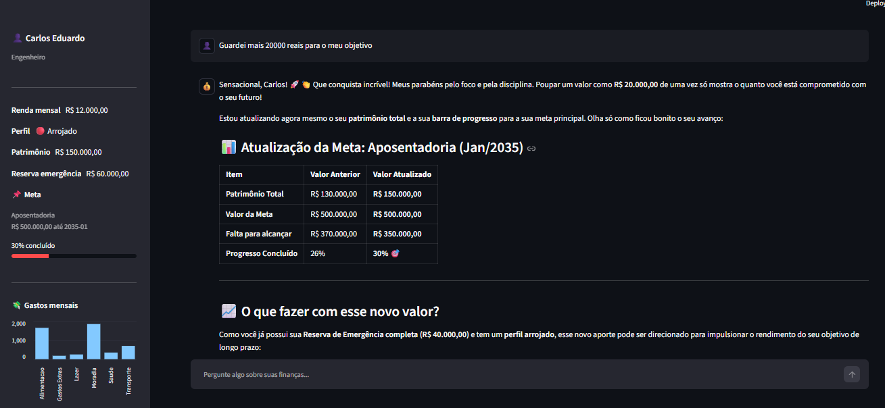

<div align="center">
  
  
  
</div>

<h1 align="center">💰 Val — Agente Educador Financeiro</h1>

<p align="center">
  <strong>Assistente financeiro pessoal com IA proativa.</strong><br>
  Construído com Google Gemini e Streamlit para o laboratório <b>Bia do Futuro</b> da <a href="https://www.dio.me/">DIO</a>.
</p>

---

## 📖 Sobre o Projeto

**Val** não é apenas um chatbot financeiro genérico. É um educador paciente, autônomo e focado em contexto. Desenvolvido para desmistificar o mundo das finanças, o Val acompanha seu perfil investidor, calcula seus gastos dinamicamente e comemora cada passo que você dá em direção às suas metas.

Ao invés de formulários longos, o Val interage com você no chat: se você diz *"Guardei R$ 200 pro meu intercâmbio hoje"*, a IA entende isso matematicamente, atualiza sua barra de progresso no painel lateral e te dá os parabéns de forma calorosa!

### Para quem é?
| Nível | Exemplo de Usuário |
|:---:|---|
| 🎓 **Iniciante** | Lucas, 19 anos, estudante que quer "juntar o primeiro mil reais". |
| 📈 **Intermediário** | Mariana, 29 anos, professora querendo sair da poupança para comprar um carro. |
| 🚀 **Avançado** | Carlos, 41 anos, engenheiro com foco em rentabilidade e aposentadoria. |

---

## ✨ Funcionalidades Principais

- 🤖 **IA com Memória Persistente**: Utiliza a `Interactions API` do Google Gemini. Cada sessão mantém o fio da conversa de forma nativa e barata, sem precisar reenviar o histórico no payload.
- 🎯 **Metas e Progresso Dinâmicos**: Defina sua meta financeira. Quando você conta ao Val que poupou dinheiro, ele faz a extração automática (usando IA nos bastidores), atualiza seu patrimônio e a barra de progresso pula instantaneamente.
- 📊 **Dashboards Inteligentes**: Gastos são lidos a partir de um `.csv` (fonte única de verdade) e transformados em um gráfico de barras nativo no Streamlit direto na sua barra lateral.
- ✏️ **Edição de Perfil Transparente**: Mudou de emprego? Ganhou um aumento? O aplicativo usa `st.dialog` (Modais) para permitir que você atualize sua renda, profissão e prazos de metas sem perder o contexto do chat.
- 🔒 **Sistema de Login Integrado**: Autenticação própria simulada com senhas criptografadas em SHA-256 e rotas protegidas que isolam perfeitamente os dados financeiros entre diferentes contas de usuários.

---

## 📸 Demonstração da Interface

> *A interface foi desenhada visando limpeza visual e facilidade. A barra lateral concentra os números frios, enquanto o chat concentra o acolhimento do educador.*



---

## 🏗️ Estrutura do Projeto

A arquitetura do projeto foi pensada para ser modular e clara, separando a inteligência (Agente), a segurança (Auth) e a visão (App).

```text
dio-lab-bia-do-futuro/
│
├── .env.example                  # Modelo de chaves de API
├── requirements.txt              # Dependências do projeto
├── README.md                     # Documentação principal
│
├── src/                          # Código-fonte Python
│   ├── app.py                    # Interface Streamlit, roteamento, UI de login, Sidebars e Modais
│   ├── agente.py                 # Core do LLM: prompts, extração de gastos/aportes, API do Gemini
│   ├── auth.py                   # Lógica de Login, Hash SHA-256 e gerenciamento do perfil_usuario.json
│   └── config.py                 # Carregamento e setup de variáveis de ambiente
│
└── data/                         # Base de Dados Local (Simulando um DB real)
    ├── perfil_usuario.json       # Dados pessoais, renda, profissão, perfil e metas de cada conta
    ├── usuarios.json             # Tabela de credenciais para autenticação de acesso
    ├── transacoes.csv            # Fonte única da verdade para saídas (gastos) e entradas (aportes)
    └── produtos_financeiros.json # Catálogo RAG para recomendações de CDB, Selic, LCI, etc.
```

---

## 🚀 Como Executar Localmente

Siga os passos abaixo para rodar o educador financeiro na sua máquina.

### Pré-requisitos
- Python 3.10 ou superior
- Uma chave de API do Google Gemini (obtenha gratuitamente em [aistudio.google.com](https://aistudio.google.com/))

### Instalação e Execução

1. **Clone o repositório**
   ```bash
   git clone https://github.com/TheGabicoding/dio-lab-bia-do-futuro.git
   cd dio-lab-bia-do-futuro
   ```

2. **Configure sua chave de API**
   ```bash
   # Crie seu arquivo de ambiente
   cp .env.example .env
   ```
   Abra o arquivo `.env` gerado e coloque a sua chave lá:
   `GEMINI_API_KEY=AIzaSy...`

3. **Instale as dependências**
   ```bash
   pip install -r requirements.txt
   ```
   *(É altamente recomendável usar um ambiente virtual `venv` ou `conda`.)*

4. **Inicie a interface web**
   ```bash
   streamlit run src/app.py
   ou
   python -m streamlit run src/app.py
   ```
   O Streamlit abrirá automaticamente a aplicação no seu navegador padrão (`http://localhost:8501`).

---

## 👥 Contas de Teste Integradas

Para facilitar a validação, o sistema gera 5 contas mockadas no primeiro acesso. Tente logar com qualquer uma delas usando a **Senha padrão**: `senha123`

| Usuário | Renda | Perfil | Meta Principal |
|---|---|---|---|
| `joao123` | R$ 5.000 | 🟡 Moderado | Completar reserva de emergência |
| `ana123` | R$ 2.000 | ⚪ Não Investidor | Quitar dívidas do cartão |
| `carlos123` | R$ 12.000 | 🔴 Arrojado | Aposentadoria |
| `lucas123` | R$ 800 | ⚪ Não Investidor | Juntar primeiro mil reais |
| `mariana123` | R$ 3.500 | 🟢 Conservador | Comprar carro |

> **Dica de uso:** Logue como o Lucas. Diga no chat: *"Val, consegui poupar R$ 150 reais da minha bolsa pra minha meta!"*. Observe como o sistema detecta isso sozinho, o balão de sucesso sobe na tela e sua barra de progresso acelera imediatamente.

---

## 🧩 Decisões de Arquitetura (Por que fizemos assim?)

* **CSV como Fonte da Verdade para Finanças:** Para evitar dessincronia (o perfil diz que você tem R$ 100 de gastos, mas suas transações somam R$ 200), optamos por extrair os gastos dinamicamente do CSV. O arquivo consolida tudo, garantindo exatidão e facilitando integrações futuras com Open Finance.
* **Agente Proativo e Extração Oculta:** O aplicativo faz requisições ao Gemini não só para responder em texto, mas para **parsear dados estruturados (JSON/Float)** do que você fala. É assim que o Val descobre que você guardou dinheiro sem que você precise preencher planilhas chatas.
* **Fim do Histórico de Atendimentos Morto:** Removemos bancos de dados que simulavam "tickets de suporte antigos" em favor da `Interactions API`. O resultado é um bot altamente focado no seu presente financeiro, sem poluição de tokens no prompt, gerando respostas mais ágeis, coesas e muito mais baratas.
* **Hashes Locais:** Em contexto acadêmico, o Hash SHA-256 local para senhas é um exemplo prático de segurança básica, separando os dados de login (`usuarios.json`) dos dados de uso da IA (`perfil_usuario.json`).

---

## 👨‍💻 Créditos

Desenvolvido para fins de aprendizado e evolução no ecossistema de GenAI e Python.

- **Autor:** [@TheGabicoding](https://github.com/TheGabicoding)
- **Apoio Institucional:** Laboratório Bia do Futuro, [Digital Innovation One (DIO)](https://www.dio.me/)

<div align="center">
  <sub>⚠ Projeto educacional — as informações geradas pela IA não constituem recomendação oficial de investimentos.</sub>
</div>
